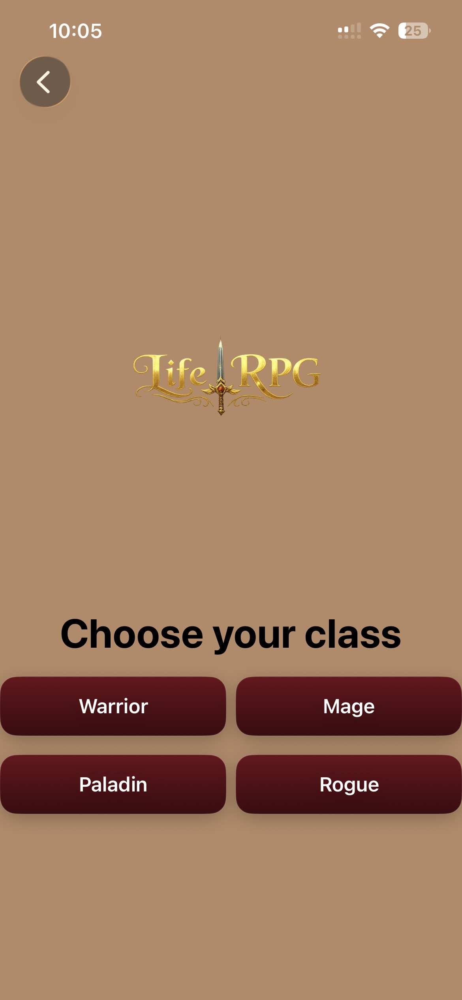
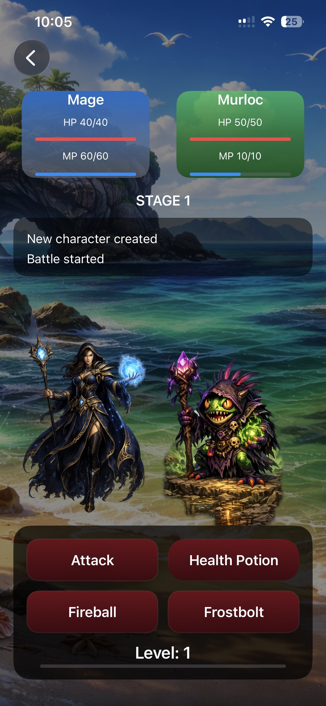
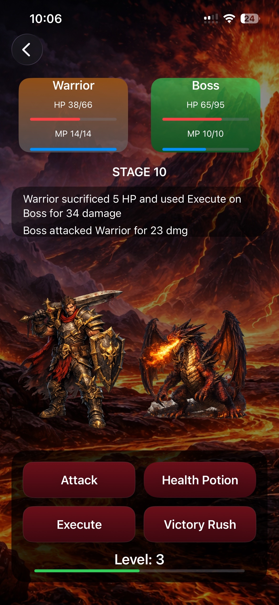

🗡️ LifeRPG

LifeRPG delivers a turn-based RPG battle experience built with SwiftUI.
Select your class, battle enemies, level up, and conquer increasingly difficult bosses.

---

🎮 Gameplay

* Choose between Warrior, Mage, Paladin, Rogue
* Fight enemies in a turn-based combat system.
* Use unique spells for each class.
* Progress through stages with scaling difficulty
* Face a boss encounter.
* Gain XP and level up.
* Save & load your progress.

---

📸 Screenshots

Character Selection

Battle (Early Game)

Boss Fight

---

🛠️ Tech Stack

* Swift
* SwiftUI
* MVVM Architecture
* Combine
* UserDefaults (Save/Load system)

---

🧠 What I Learned

* Managing state in SwiftUI
* Implementing MVVM in a real project
* Building a turn-based combat system
* Handling game progression (XP, levels, scaling)
* Persisting data using UserDefaults
* Debugging and fixing real-world bugs

---

⚔️ Core Systems

* Class-based player system
* Spell system with mana & cooldown logic
* Enemy scaling based on stage.
* Battle log system
* Save & load game state.

---

📌 Future Improvements

* More enemy types
* Additional bosses
* Sound effects & animations
* Expanded settings system
* UI polish & effects

---

📂 Project Structure

* Models → Player, Enemy, Classes
* ViewModel → Battle logic & state management
* Views → UI components & screens

---

🚀 Author

Built by Dimitris Poluzos
iOS Developer in progress 🚀# LifeRPG

