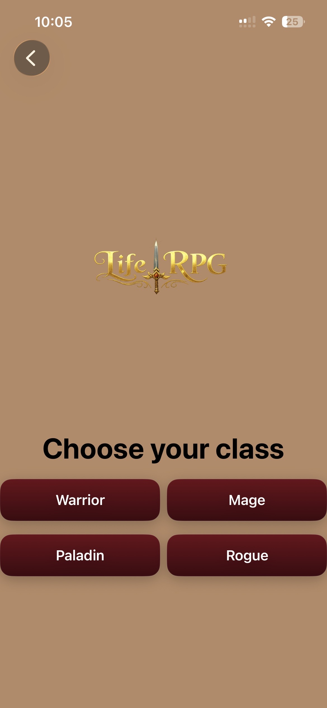
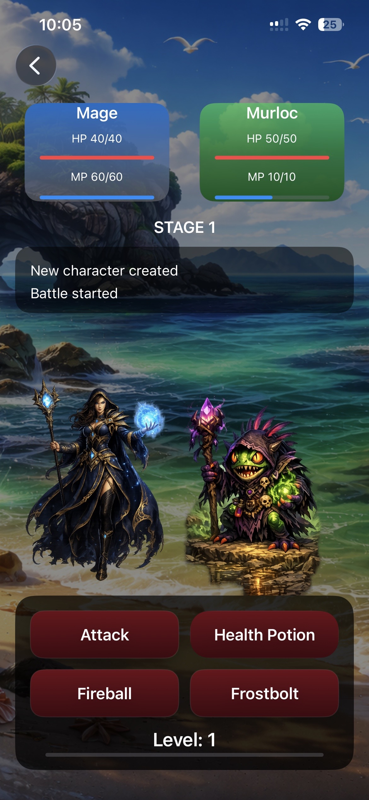
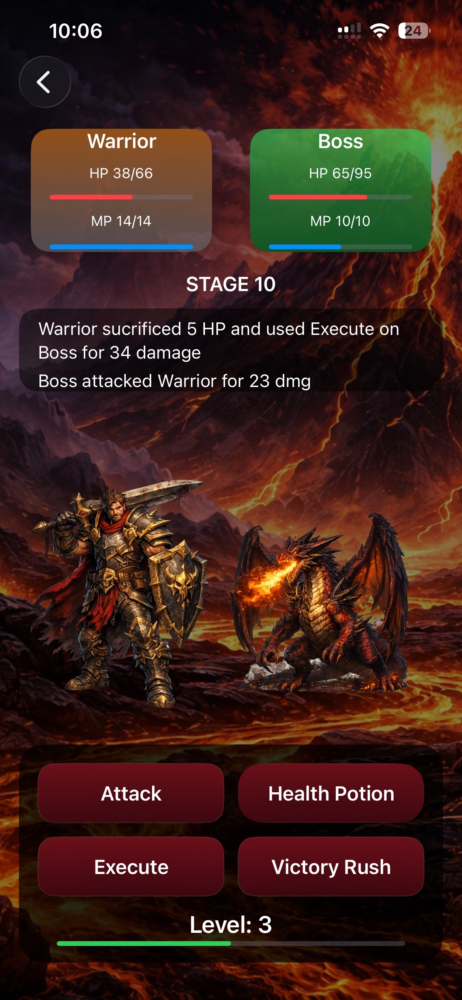

# 🗡️ LifeRPG

A turn-based RPG battle game built with SwiftUI — choose a class, fight scaling enemies, level up, and progress through stages toward a boss.

This project began as my **first iOS app**. It started as a single 436-line `BattleViewModel` "God Object" that did everything. I later used it as a hands-on exercise to refactor toward **SOLID principles**, breaking that monolith into five focused, independently testable services behind protocols.

> The interesting part of this repo isn't the gameplay — it's the architecture journey from a tangled God Object to a clean, test-covered, dependency-injected design.

---
📸 Screenshots


<p align="center">
  
  
  
</p>

---

## 🏗️ Architecture: from God Object to SOLID

The original `BattleViewModel` (436 lines) handled persistence, enemy spawning/scaling, player stats, spell logic, and logging all at once. It was refactored into five services, each with a single responsibility, each injected into the view model behind a protocol.

| Service | Responsibility | SOLID principle highlighted |
|---|---|---|
| `SaveService` | Encode/decode and persist game state | SRP + DIP (abstracts away the storage layer) |
| `EnemyService` | Spawn enemies with stage-based HP/damage scaling | SRP (stateless rules engine) |
| `PlayerStatsService` | Level-up rules (stat growth, refill) | SRP (pure transformation of `Player`) |
| `SpellService` | Apply spell effects (damage / heal / costs) | OCP (data-driven — new spells need no code change) |
| `BattleLogService` | Battle log with capped history | SRP |

The view model now **orchestrates** these collaborators instead of doing the work itself.

### How each SOLID principle shows up

**S — Single Responsibility.** Each service owns exactly one concern. The view model coordinates; it no longer knows *how* saving, scaling, or spell math works.

**O — Open/Closed.** Spells are modeled as **data**, not hardcoded methods. A `Spell` struct carries `damage`, `heal`, `manaCost`, `hpCost`, and `scalingPerLevel`. A single `cast(_:player:enemy:)` method applies any spell, so adding a new spell means adding a new `Spell` constant — **no existing code is modified**.

**D — Dependency Inversion.** The view model depends on protocols (`SaveService`, `EnemyService`, …), not concrete types. Concrete implementations are injected via the initializer with sensible defaults:

```swift
init(
    battleLog: LogService? = nil,
    saveDataService: SaveService? = nil,
    enemyService: EnemyService? = nil,
    playerStatsService: PlayerStatsService? = nil,
    spellService: SpellService? = nil
) {
    self.saveDataService = saveDataService ?? SaveGameService()
    // ...
}
```

`SaveService` goes one layer deeper: instead of depending directly on `UserDefaults`, it depends on a small `KeyValueStore` protocol. `UserDefaults` conforms to it via a retroactive extension, and tests inject an in-memory implementation — so the persistence layer is fully swappable (a SwiftData backend could drop in without touching the view model).

---

## ✅ Testing

15 unit tests using the **Swift Testing** framework (`@Test` / `#expect`), made possible by the architecture above:

- **SaveService** — round-trip (save → load returns identical state) and empty-load returns `nil`, run against an injected in-memory `KeyValueStore` (no real `UserDefaults` pollution).
- **EnemyService** — correct enemy name, HP, and damage per stage (stateless rules → trivial to test).
- **PlayerStatsService** — level-up applies the correct stat changes.
- **SpellService** — damage scaling, cost deduction, healing, and the heal cap (no overheal past `maxHP`).
- **BattleLogService** — appends messages and caps history at 20 entries.

The refactor also surfaced and fixed several real bugs along the way — e.g. `execute()` applying *unscaled* damage while logging the scaled value, and inconsistent class stats living in two places (model vs. view model) that could disagree.

---

## 🎮 Gameplay

- Choose between **Warrior, Mage, Paladin, Rogue**, each with two unique spells
- Turn-based combat with mana/HP costs and level-based spell scaling
- Stage-based enemy scaling, culminating in a boss
- XP, leveling, and save/load of progress

---

## 🛠️ Tech Stack

- Swift / SwiftUI
- MVVM with protocol-oriented, dependency-injected services
- Combine (`ObservableObject` / `@Published`)
- Swift Concurrency (`@MainActor`)
- `UserDefaults` persistence behind a `KeyValueStore` abstraction
- Swift Testing (unit tests)

---

## 📂 Project Structure

```
LifeRPG/
├── Model/         # Player, Enemy, PlayerClass, Spell, SaveData
├── ViewModel/     # BattleViewModel + 5 services (Save, Enemy, PlayerStats, Spell, Log)
├── View/          # SwiftUI screens & battle UI components
└── LifeRPGTests/  # 15 unit tests + in-memory store mock
```

---

## 🚀 Future Improvements

- Refactor spell effects to a closure-based model for even stricter OCP
- More enemy types and bosses
- Sound effects & combat animations
- A second `SaveService` backend (SwiftData) to demonstrate the swappable persistence layer

---

## 👤 Author

Built by **Dimitris Polyzos** — iOS Developer
[github.com/dimitrispolyzos99](https://github.com/dimitrispolyzos99)
---

